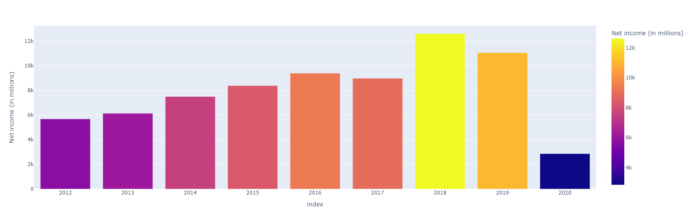
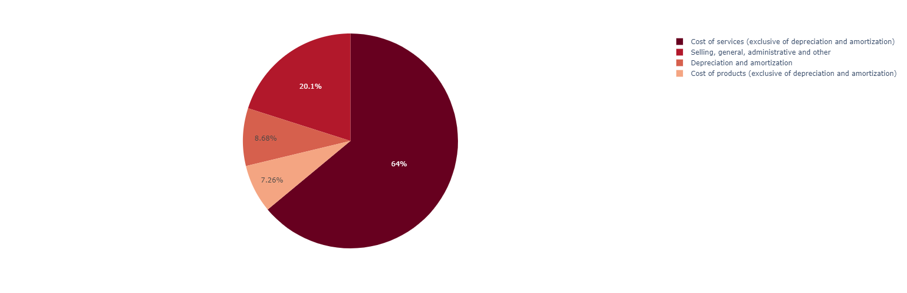
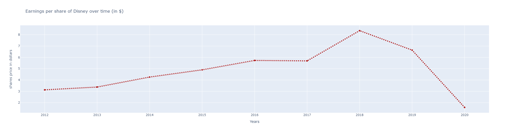
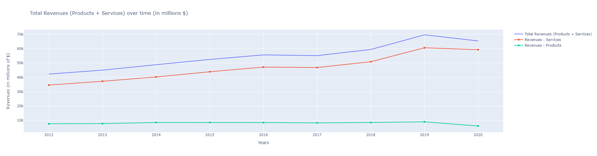

# Financial Report Scrapping and Analysis
Scrapping of The Walt Disney Company's annual reports to perform financial analysis.

## Project details
I used <b> pdfminer.six </b> and <b>tabula</b> to scrape the pdfs and get the consolidated income statements. 
Then, I used Plotly in order to make some graphs allowing to observe the evolution of the total revenue, the costs as well as the evolution of the price of the Disney shares.

# Prediction example

## Income Over Time

## Total Costs in 2020

## Share Price Over Time

## Total Revenues of Disney between 2012 and 2020

